# General Analysis Process

## Process in Abaqus

  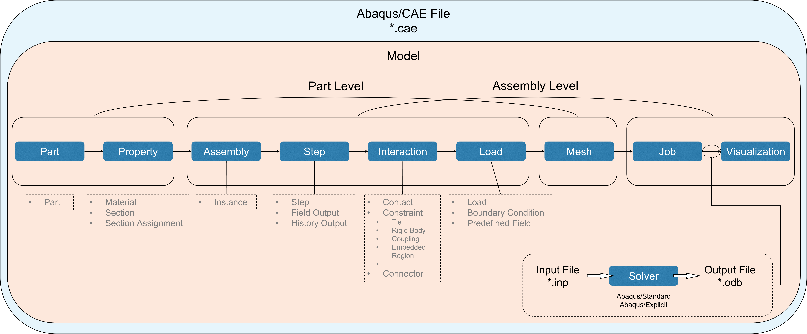

---

## Process in Abaqus vs Process in HyperWorks

  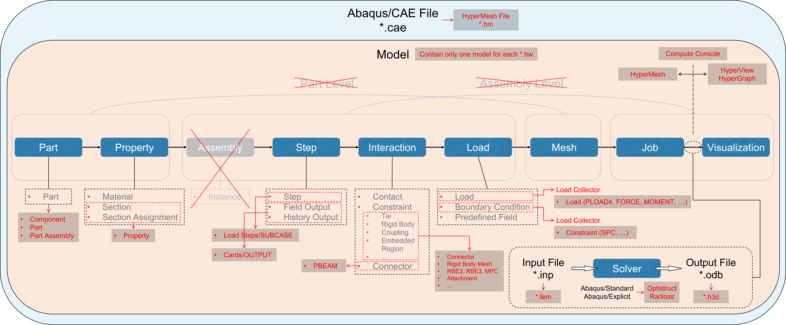

---

## Import the model from Onshape to HyperWorks
1. In **Onshape**, Right click on the tab for the specific assembly, then click **Export...**
2. Select **PARASOLID**
3. Click **Export**
4. Go to HyperWorks. **File** > **Import...** > **Geometry Model**
5. Select the model from Onshape and click **Open**
6. Select the desired unit system like **MMKS**
7. Click **Import**

  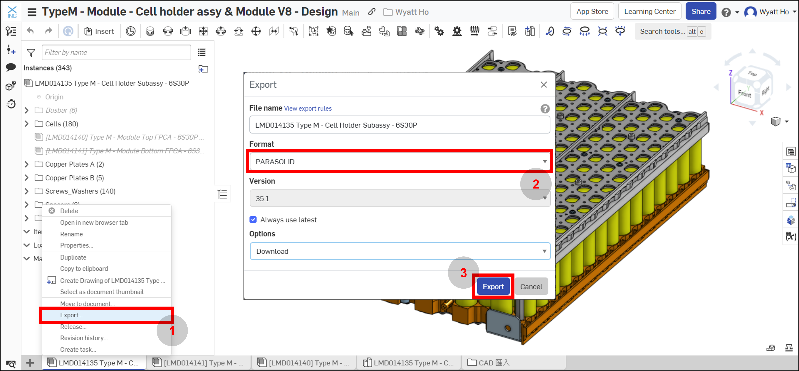
  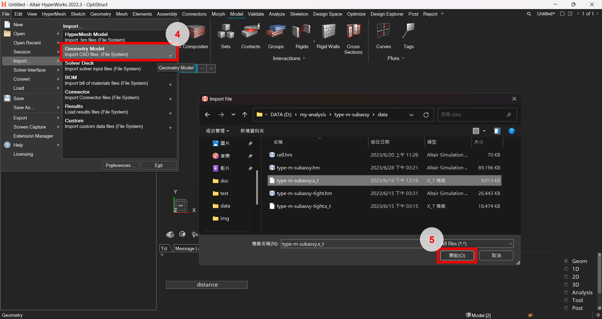
  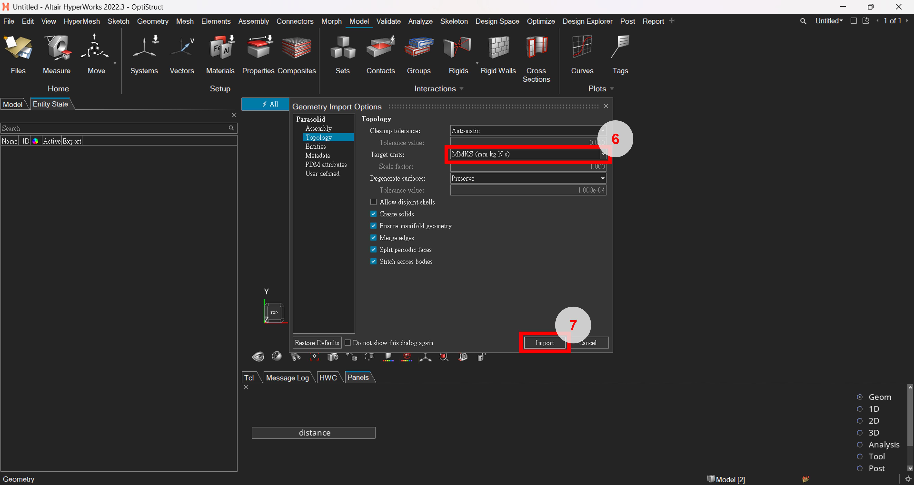

---

## The Basic of Creating Boundary Conditions
1. Right click on the Model Browser > Create > Load Collector
2. Naming **SPC** for this Load Collector conventionally
3. Click Model Ribbon > Rigids. To create RBE2 for the nodes with the same BC
4. Click Analyze Ribbon > Constraints. To assign the BC (SPC) to the independent node of the RBE2.

  
  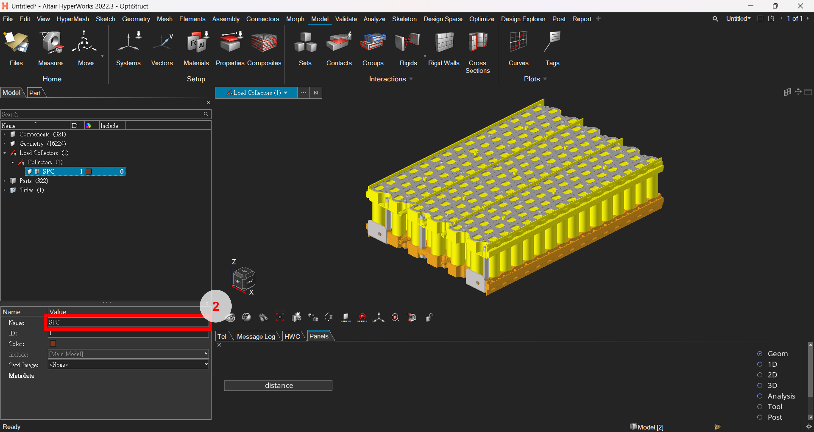
  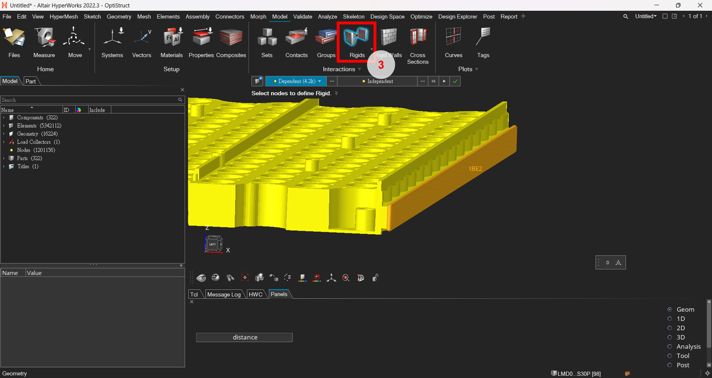
  
  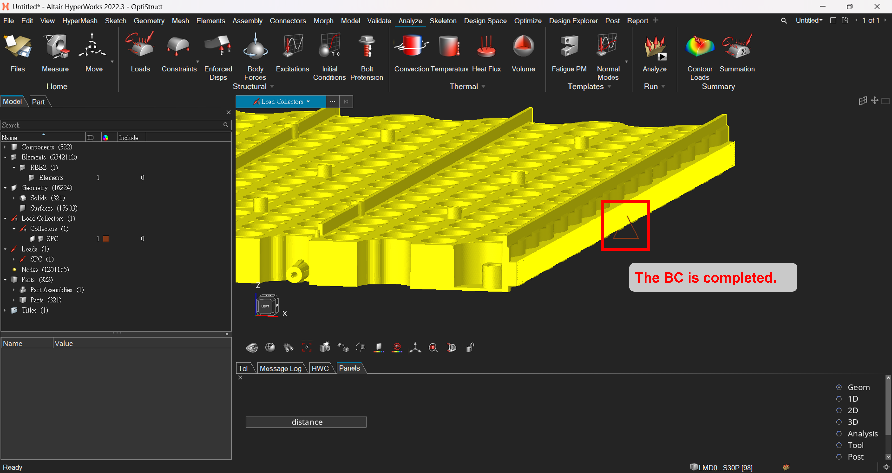

---

## The Basic of Creating Loads
1. Right click on the Model Browser > Create > Load Collector
2. Naming **Load** for this Load Collector conventionally
3. Click Analyze Ribbon > Loads (Pressures). To create pressure on the specific entities with specific magnitude.

  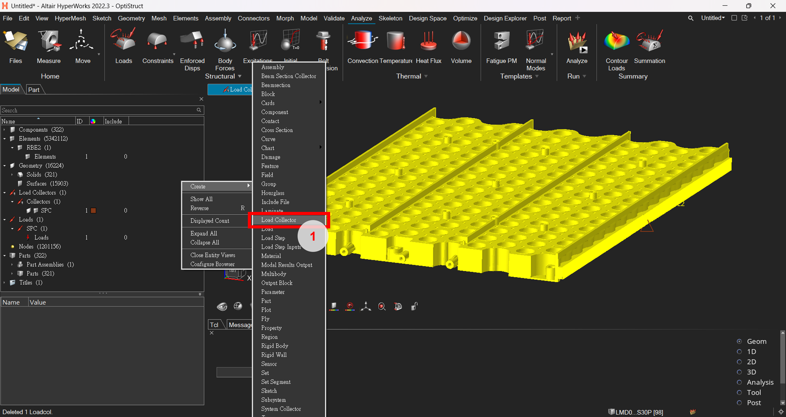
  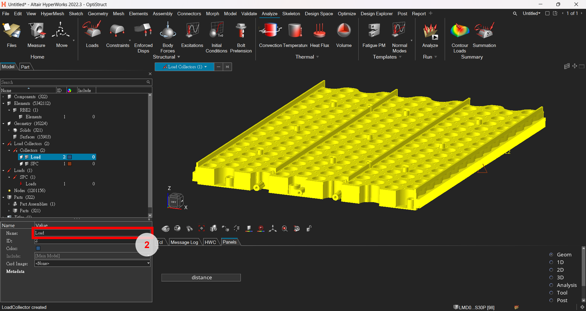
  
  

---

## The Basic of Setting an Analysis
1. Right click on the Model Browser > Create > Load Step, then a **subcase** would be created.
2. Naming the subcae and assign its **analysis type**, **BCs** and **loads**.
3. Right click on the Model Browser > Create > Cards > Output, then a **GLOBAL_OUTPUT_REQUEST** card would be created.
4. Activate the **STRAIN** item. Normally, stress and displacement are default output.

  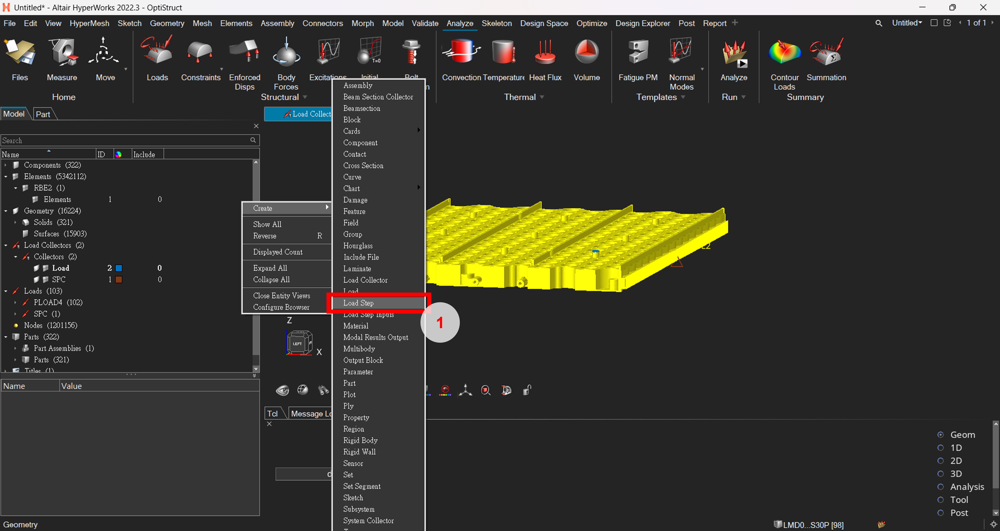
  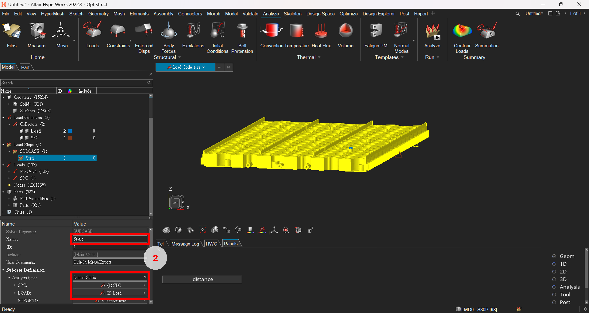
  
  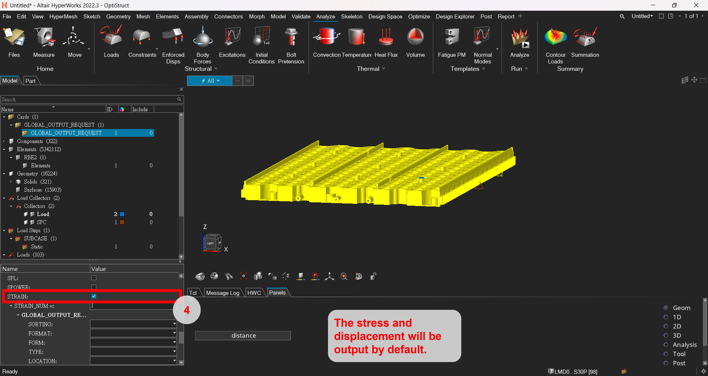

---

# Running an Analysis
1. Click Analyze Ribbon > Analyze (Run)
2. Give a name for ***.fem**
3. Click Export
4. **Compute Console** will pop up. Click **...**
5. Set the options **-nt** (cpus), **-core** (control of used memory)
6. Click Apply Selected
7. Click Run

  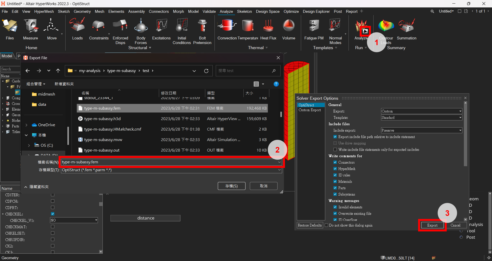
  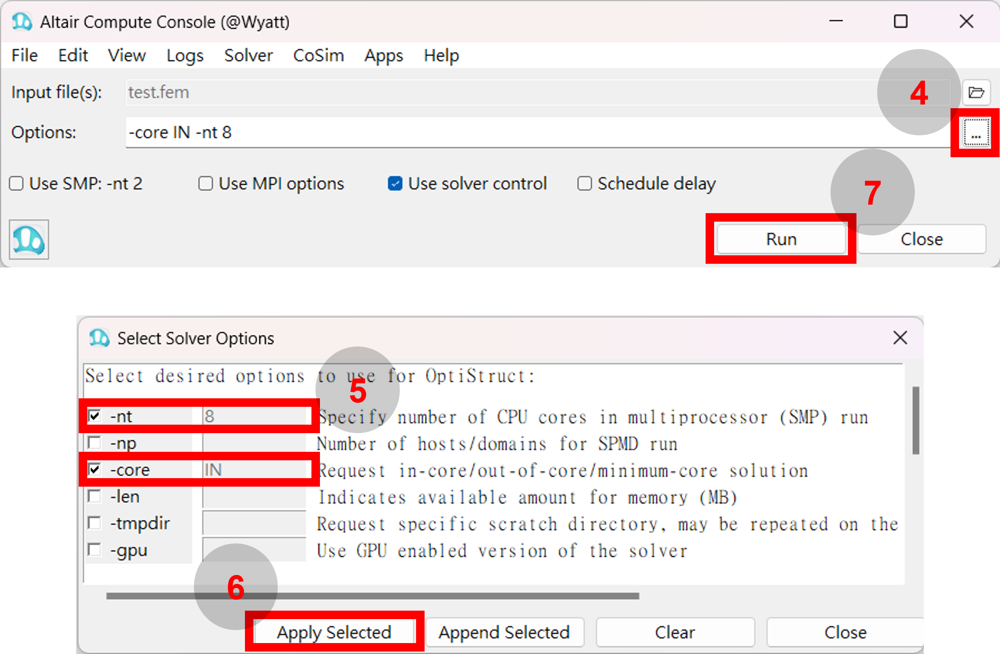

Reference: 
  - <https://2022.help.altair.com/2022/hwsolvers/os/topics/solvers/os/run_options_os_r.htm>
