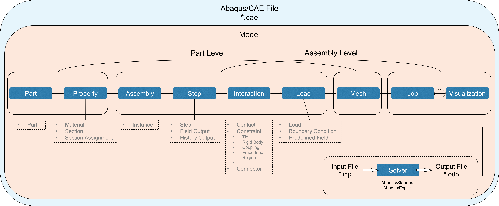
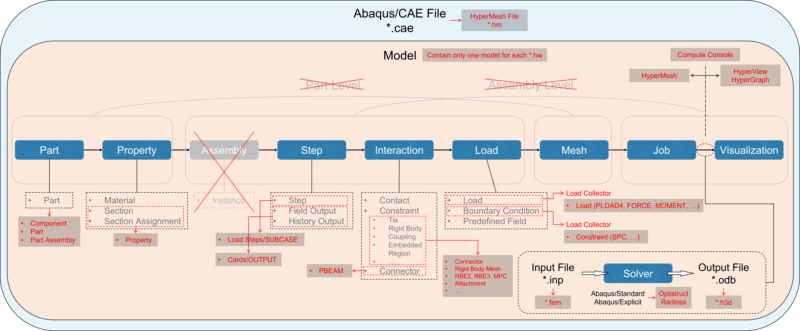

# Process in Abaqus

# Process in Abaqus vs Process in HyperWorks

---

# CAE Hierarchy
- Components
  - Components collect and organize points, lines, surfaces, solids, elements and connectors
  - A component can be assigned **a property or material**, that assignment is applied to all elements within that component
  - **Indirect** property and material assignment is performed on the component level
  - **Direct** property and material assignment is performed directly on the elements themselves
- Parts
  - A part is an engineering representation of a physical part
  - A part can only contain components
- Part Instances
  - Part Instances are recognized from **PDM**, are automatically converted on import into HyperMesh
- Part Assemblies
  - A part assembly is a group of part assemblies and/or parts
- Model
  - The model is the root of the hierarchy
  - It represents the contents of the HyperMesh binary file and can contain part assemblies, parts, and components.

References:
  - https://help.altair.com/hwdesktop/hwx/topics/pre_processing/entities/components_r.htm
  - https://help.altair.com/hwdesktop/hwx/topics/pre_processing/model_build_and_assembly/part_assemblies_and_parts_organize_t.htm
  - https://help.altair.com/hwdesktop/hwx/topics/pre_processing/model_build_and_assembly/part_and_part_assembly_about_c.htm

---

# CAD Hierarchy
- Feature
  - The operations that are used to build **parts**, such as 
    - Extrude
    - Revolve
    - Sweep
    - ...
- Part
  - A single closed solid body created by features
- Instance 
  - A part, sketch, surface, or subassembly used in an Assembly
- Subassembly
  - An assembly used within another assembly
- Assembly
  - A collection of instances of parts, sketches, surfaces, or subassemblies
  - An environment where you can define both **position** and **movement** of a complete product or system

References:
  - https://superdope.onshape.com/help/Content/Glossary/glossary.htm?tocpath=_____22

---