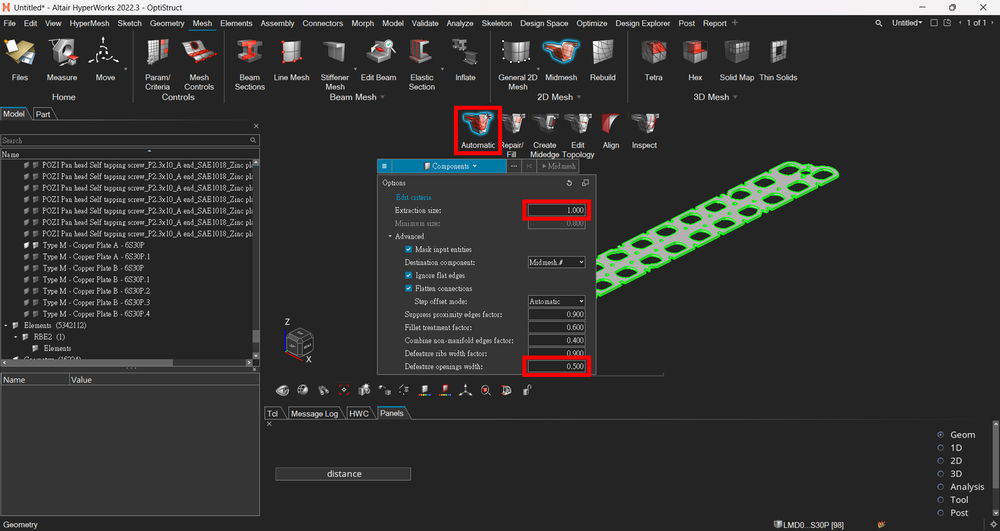
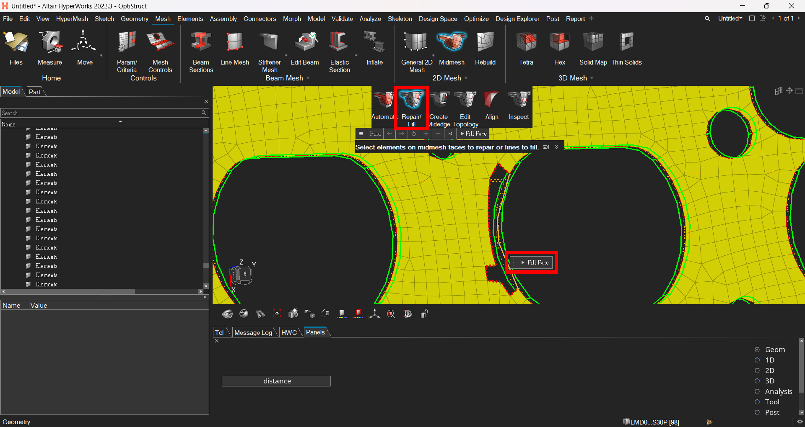
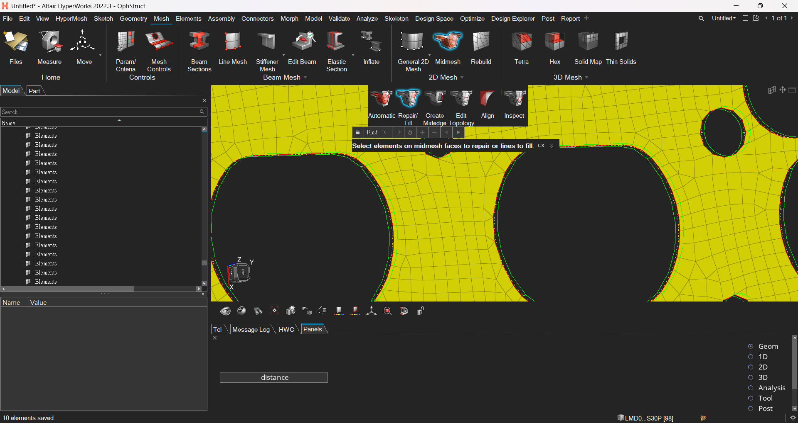
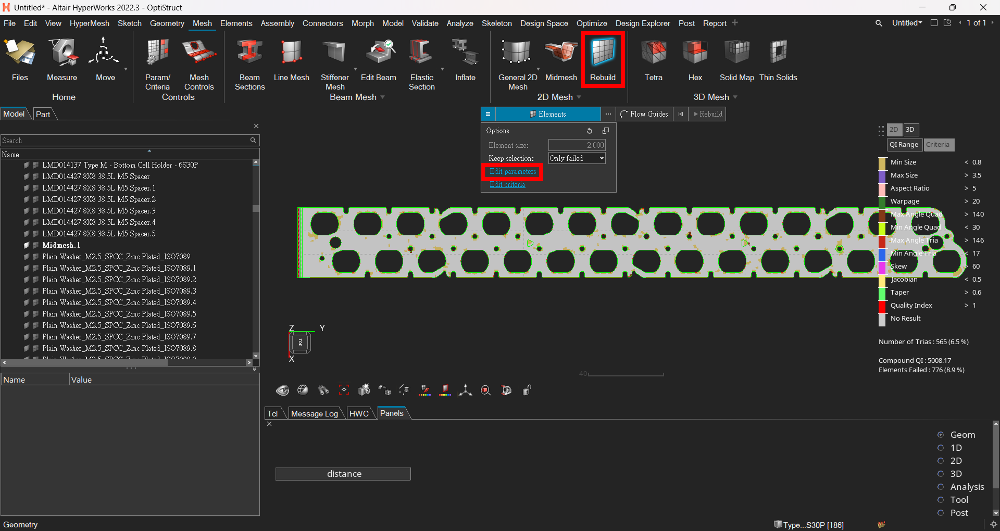
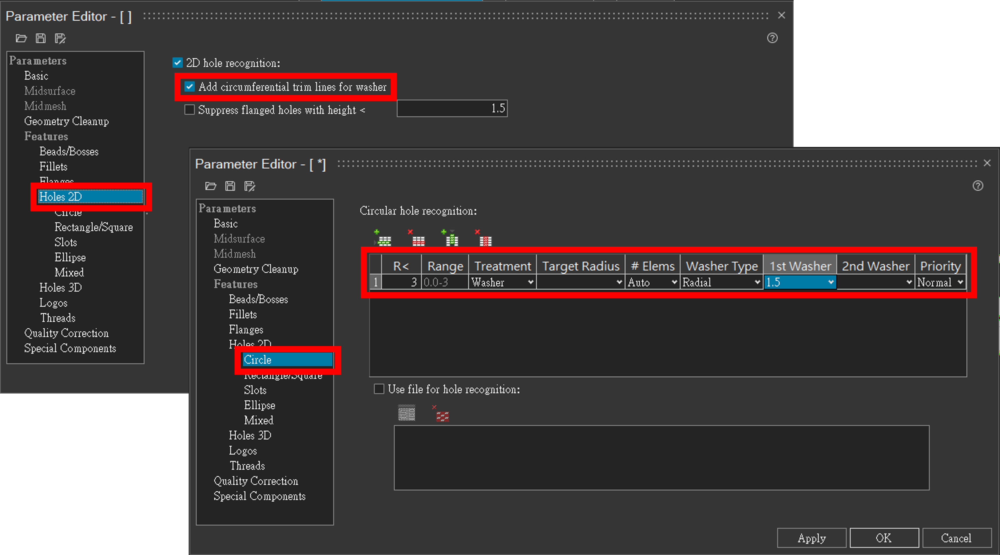
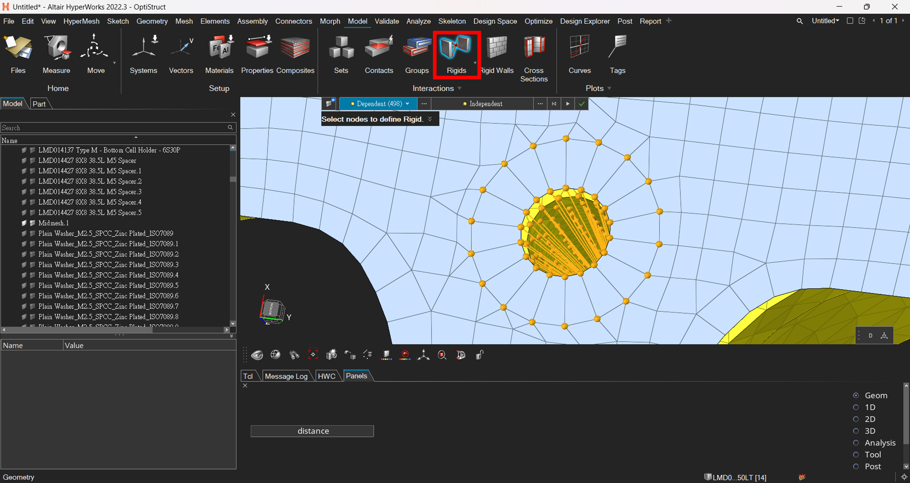
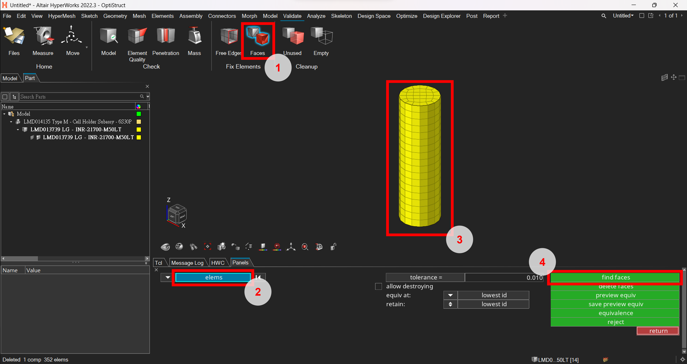
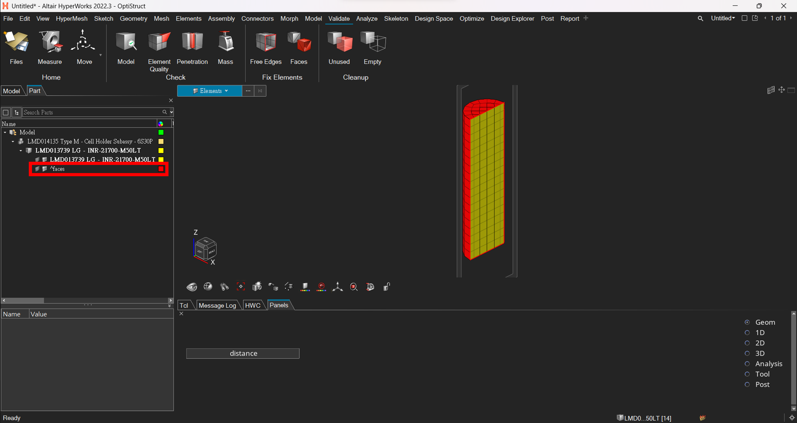
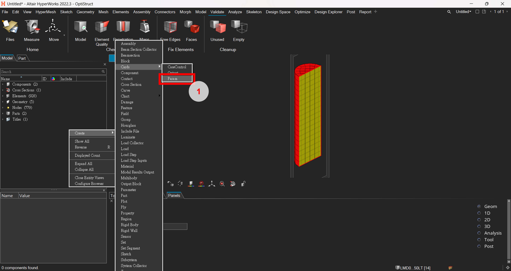
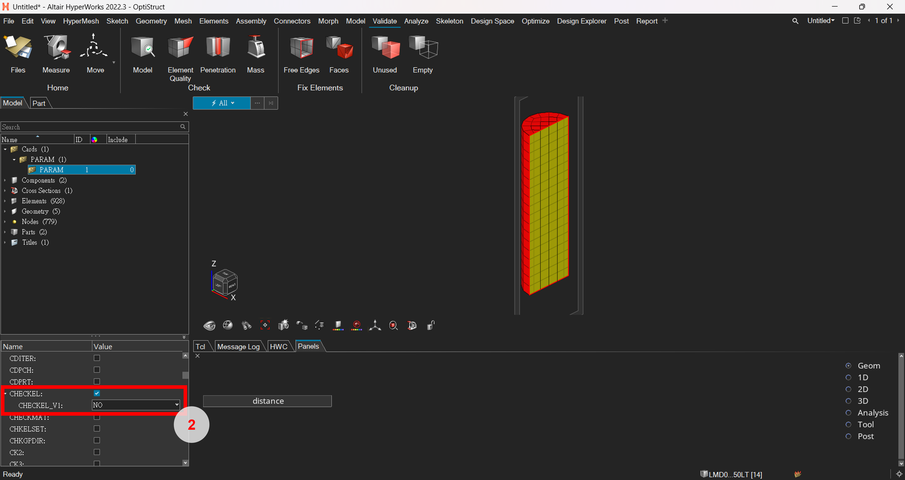

# Midmesh

## Create Midmesh Automatically
1. Click Midmesh Ribbon > Automatic
2. Set **extraction size** (element size) and **defeature openings width**
3. Sometimes there would be defects for the midmesh. Manually repair as follow will be helpful.

  
  

---

## Repair Omitted Region
1. Click Midmesh Ribbon > Create Midedge. Select nodes and guide to create a midmesh boundary.
2. Click Midmesh Ribbon > Repair/Fill. Select the enclosed boundary to fill the region with mesh.

  
  
  

---

## Repair Overfilled Region
1. Click Midmesh Ribbon > Edit Topology. Select line geometry to imprint the midmesh.
2. Click the left button to switch different mode
3. After imprint, Delete the elements within the hole manually

  
  
  
  

---

# Screw Settings

## Rebuild Elements for Washers
1. Click Rebuild Ribbon > Edit parameters
2. Activate "Add circumferential trim lines for washer"
3. Input parameters for circular hole recognition
4. Select the elements adjacent to the hole and rebuild

  
  
  

---

## Use RBE2 to Represent Screws
1. Click Model Ribbon > Rigids
2. Select the nodes for washer and hole to create RBE2 element

  

---

# Create 2D Elements on Solids
1. Click Validate Ribbon > Faces
2. Choose **elems** as the target entity
3. Select the solid elements
4. Click **find faces**
5. A new component with 2D elements enclosing the solids created

  
  

---

# Skip Element Quality Checks
I've ran an analysis with tetra solid elements but failed the element quality check.
However, those failed element seemed not too bad. The way to fix it is to close the check action.
1. Right click on the Model Browser > Create > Cards > Param
2. Activate **CHECKEL** item and set as **NO**

  
  

