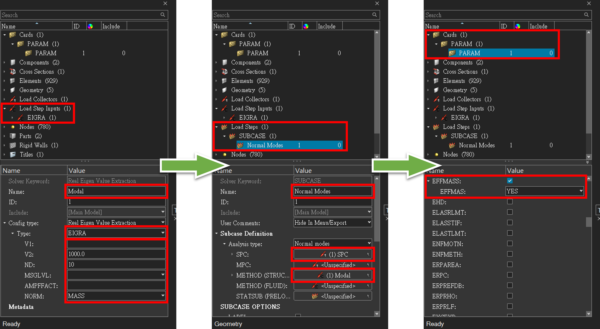
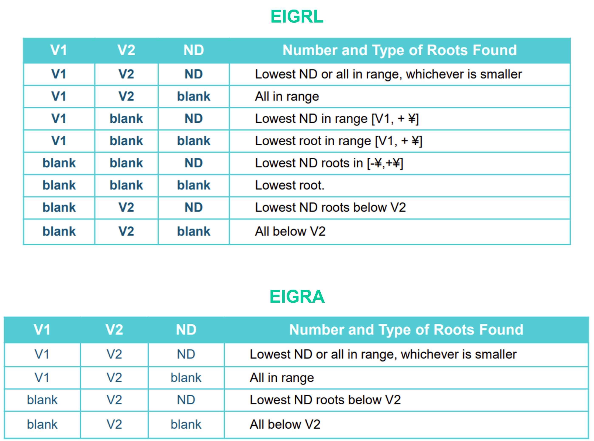
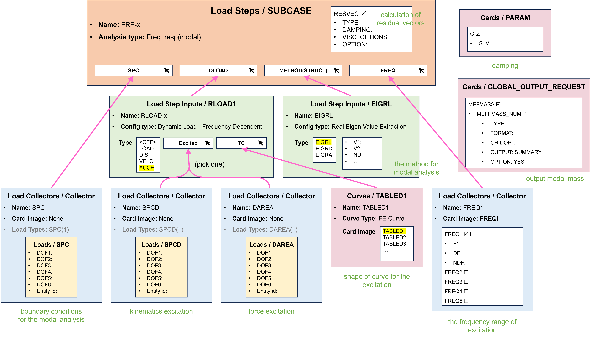
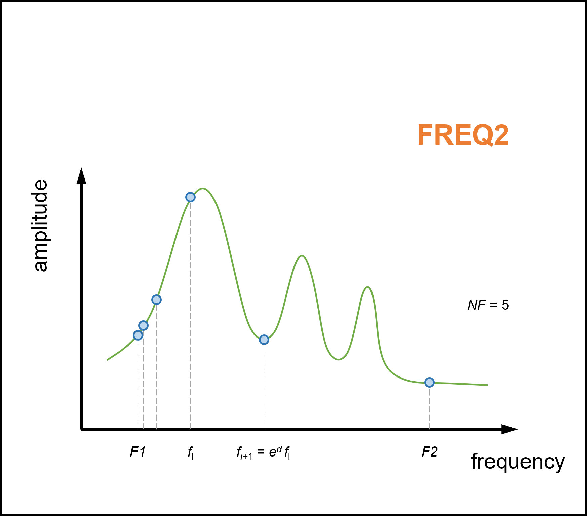
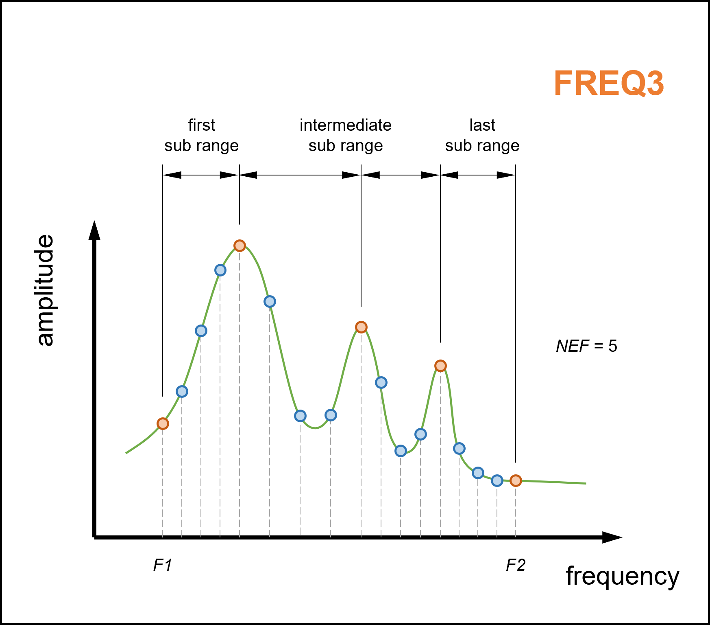
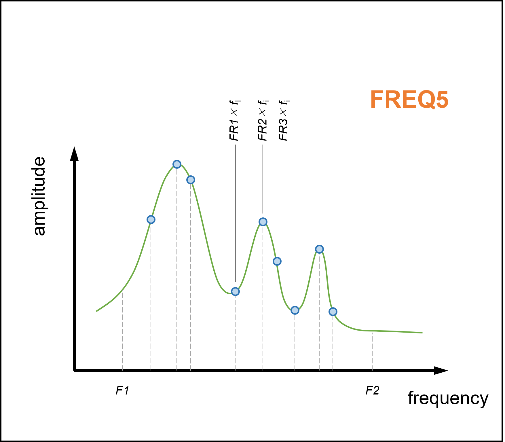

# Modal and FRF Analysis

## Modal Analysis

### Algorithms
In OptiStruct, normal modes analysis can be performed using one of two algorithms.

| Algorithm | Card name | Pros | Cons |
|-----------|-----------|------|------|
| Lanczos | EIGRL | accurate | slow for large problems (millions of DOF, hundreds of modes) |
| AMSES | EIGRA | much shorter run times | calculations are not exact (modal frequencies are still accurate to a few digits) |

Reference: <https://help.altair.com/hwsolvers/os/topics/solvers/os/analysis_normal_modes_r.htm#analysis_normal_modes_r>

---

### Setting Procedures
1. Create a **Load Step Input** and name it **Modal** conventionally. **EIGRL** or **EIGRA** should be choosed depending on the situation. The required parameters are shown as the following tables.
2. Create a **Load Step** and select **Normal modes** as the analysis type. Name it **Normal Modes** conventionally. Select the existed SPC (Load Collector) and METHOD (Load Step Input).
3. Create card **PARAM** and activate the output **EFFMASS** so that the effctive mass corresponding to each modes would be output at the `*.out` file.

  
  
  

---

## Frequency Response Analysis (FRA)

### Methods
Two types of frequency response analysis:
1. Direct frequency response analysis
2. Modal frequency response analysis, with different solvers:
   - Regular factorization (default)
   - FASTFR (default)
   - FFRS

---

### Requirements for Frequency Range
- Accurate data from modal frequency response requires calculating modes at frequencies higher than the required excitation frequency. 
- Recommended modal frequency range >= 1.5 to 2 times the excitation frequency range. 
- For example, to get accurate modal frequency response predictions to 300 Hz, you should calculate the modes to >= 450Hz.

---

### Frequency Response Function (FRF)
The term **FRF** is frequently mentioned in the Altair tutorial slides without any accompanying explanation. To address this lack of information, I have discovered a reference that provide the explanation about it.

> The FRF of a system is often referred to as its "transfer function" but this term should strictly be reserved for the response of the system expressed in Laplace notation. 

  

---

### Mind Map of FRF Analysis

  

---

### SPCD
- The `SPCD` card defines an enforced displacement, velocity or acceleration.
- To create Loads/SPCD, click Analyze ribbon > Constraints

---

### DAREA
- The `DAREA` card represents a force excitation loading.
- To create Loads/DAREA, click Analyze ribbon > Constraints

---

### RLOAD
- RLOAD1
  - $P(f) = A[C(f) + iD(f)]e^{i(\theta-2\pi f\tau)}$
  - A: EXCITEID
  - C: TC
  - D: TD
  - $\tau$: DELAY
- RLOAD2
  - $P(f) = A \times B(f) e^{i(\varphi(f) + \theta - 2\pi f\tau)}$
  - A: EXCITEID
  - B: TB
  - $\varphi(f)$: TP
  - $\theta$: DPHASE
  - $\tau$: DELAY

---

### TABLED
$$
y = \left\{
  \begin{aligned}
    y_T (x) && \text{, for TABLED1} \\ 
    y_T (x - X_1) && \text{, for TABLED2} \\
    y_T (\frac{x - X_1}{X_2}) && \text{, for TABLED3} \\
    \sum_{i=0}^{N}{A_i(\frac{x - X_1}{X_2})^i} && \text{, for TABLED4}
  \end{aligned}
\right. 
$$

where $X_1$, $X_2$ and $A_i$ are input parameters and

$$
y_T(x) = \left\{
  \begin{aligned}
    \frac{(x_j - x)}{(x_j - x_i)}y_i + \frac{(x - x_i)}{(x_j - x_i)}y_j && \text{, for linear-x and linear-y} \\
    \frac{\ln(x_j/x)}{\ln(x_j/x_i)}y_i + \frac{\ln(x/x_i)}{\ln(x_j/x_i)}y_j && \text{, for log-x and linear-y} \\
    \exp\left[\frac{(x_j - x)}{(x_j - x_i)}\ln y_i + \frac{(x - x_i)}{(x_j - x_i)}\ln y_j\right] && \text{, for linear-x and log-y} \\
    \exp\left[\frac{\ln(x_j/x)}{\ln(x_j/x_i)}\ln y_i + \frac{\ln(x/x_i)}{\ln(x_j/x_i)}\ln y_j\right] && \text{, for log-x and log-y} \\
    y_i + (y_j - y_i) \frac{\left(x - x_i\right)^3}{\left(x_j - x_i\right)^3}\left(10 - 15 \frac{\left(x - x_i\right)}{\left(x_j - x_i\right)} + \frac{\left(x - x_i\right)^2}{\left(x_j - x_i\right)^2} \right) && \text{, for linear-x and smooth-y}
  \end{aligned}
\right. 
$$

---

### FREQi

  
  
  
  
  

---
